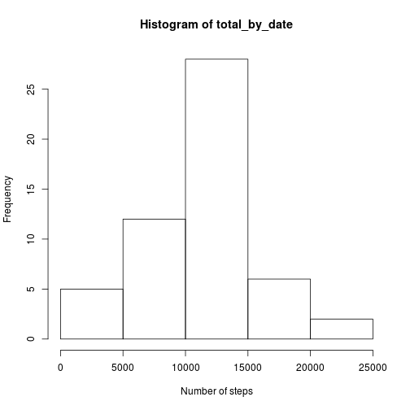
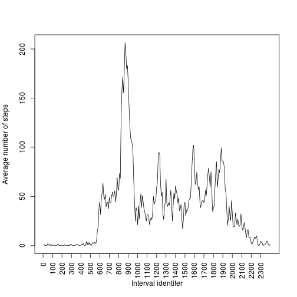
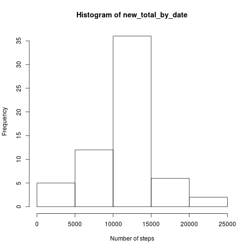
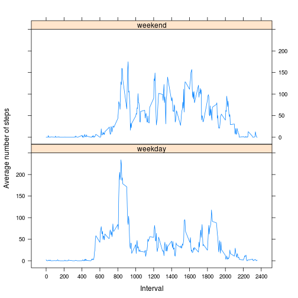

## Loading and preprocessing the data


```r
data <- read.csv('activity.csv')
data$interval <- factor(data$interval)
head(data)
```

```
##   steps       date interval
## 1    NA 2012-10-01        0
## 2    NA 2012-10-01        5
## 3    NA 2012-10-01       10
## 4    NA 2012-10-01       15
## 5    NA 2012-10-01       20
## 6    NA 2012-10-01       25
```

The variables included in this dataset are:

   * steps: Number of steps taking in a 5-minute interval (missing values are coded as NA)
   * date: The date on which the measurement was taken in YYYY-MM-DD format
   * interval: Identifier for the 5-minute interval in which measurement was taken

The dataset is stored in a comma-separated-value (CSV) file and there are a
total of 17568 observations in this dataset.

## What is mean total number of steps taken per day?

First we calculate the total number of steps each day.


```r
total_by_date <- tapply(data$steps, data$date, sum)
```

When plotted as a historgram we get the following.


```r
hist(total_by_date, xlab='Number of steps')
```

 

The mean numbers of steps per day is 10766 and the median is 10765 (excluding NA entries).

## What is the average daily activity pattern?

Now we calculate the average number of steps per 5-minute interval (excluding NA entries).


```r
avg_by_interval <- tapply(data$steps, data$interval, mean, na.rm=TRUE)
```

Plotted over the course of the day this gives:


```r
plot(avg_by_interval, type="l", xlab="Interval identifer", ylab="Average number of steps", xaxt='n')
axis(1, labels=names(avg_by_interval)[0:23*12+1], at=0:23*12, las=2)
```

 

The average is maximum in interval 835.

## Inputing missing values

In the above calculations we ignored the NA entries. But since there are 
2304 (13.1% of the dataset)
 such entries we can try to estimate what they were. Note this is 
To adjust for the missing data values we do some simple prediction.  We
assume that the distribution of steps over the day is the same, but the
total number of steps can vary.  So first we normalise the number of steps
per days.


```r
data$normal_steps <- ave(data$steps, data$date, FUN=function(x) x/sum(x, na.rm=TRUE))
```

Then we average per interval so we have expected distribution over steps over the day.


```r
data$expected_steps <- ave(data$normal_steps, data$interval, FUN=function(x) mean(x, na.rm=TRUE))
```

Then we estimate the total number of steps per day by averaging the entries we do have and compensating for those missing. If there is no data at all we assume the average of all days.


```r
data$day_total <- ave(data$steps, data$date, FUN=function(x) mean(x, na.rm=TRUE)*12*24)
data$day_total[is.nan(data$day_total)] <- mean(total_by_date, na.rm=TRUE)
```

The prediction is then the product of the expected distribution and the estimated total steps.


```r
data$predict <- round(data$day_total * data$expected_steps)
```

Create a new dataset with the filled in data.


```r
new_data <- data.frame(steps=ifelse(is.na(data$steps),
                       data$predict, data$steps),
                       date=data$date, interval=data$interval)
```

We now redo the histogram we made above.


```r
new_total_by_date <- tapply(new_data$steps, new_data$date, sum)
hist(new_total_by_date, xlab='Number of steps')
```

 

The mean numbers of steps per day in this new dataset is 10765 and the median is 10760.

These are very close to the numbers before, probably because we based the new data on the averages of the existing data.

The total number of steps went from 570608 to 
656688.  This is because the missing data was not
randomly distributed, instead 8 days were completely missing.

## Are there differences in activity patterns between weekdays and weekends?

To determine if there is a difference we add a new factor variable to our dataset.


```r
data$weekday <- factor(ifelse(weekdays(as.Date(data$date)) %in% c("Saturday", "Sunday"), "weekend", "weekday"))
```

And then we plot the output.


```r
library(lattice)
library(reshape)

plot_data <- melt(tapply(data$steps,
                         list(data$interval, data$weekday), 
                         FUN=mean, 
                         na.rm=TRUE), 
                  c("interval", "weekday"))
xyplot(value ~ interval | weekday,
       data=plot_data, 
       type="l", 
       layout=c(1,2), 
       ylab="Average number of steps", 
       xlab="Interval",
       scales=list(x=list(tick.number=10)))
```

 

Clearly there is a big difference between weekdays and weekends, especially in the morning.
